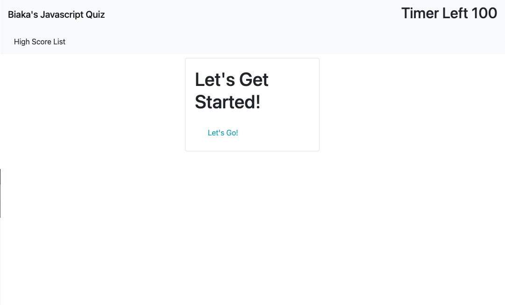

<h1 align="center">Biaka's Javascript Quiz!!</h1>

## Description
📖 Biaka's Javascript Quiz will allow a coding bootcamp student to take a timed quiz on JavaScript fundamentals that stores high scores SO THAT you can gauge your progress compared to your peers. Go ahead and try it out on the link below!

## Deployed Site
[Biaka's Javascript Quiz Deployed Site](https://biakaworks.github.io/weather-dashboard/)

## Screenshot

## License

 
This application is covered by the Mozilla license. 

## Table of Contents
- [Description](#description)
- [Deployed Site](deployedsite)
- [Screenshot](#screenshot)
- [Installation](#installation)
- [Contributing](#contributing)
- [Tests](#tests)
- [Email](#email)
- [GitHub](#gitHub)
- [Questions](#questions)

## Installation
💿 You can run the application here.  It uses HEROKU to deploy. It will use your browser.

## Contributing
🤝 Myself (biaka) and with the help of friends, tutors and the [internet](https://www.w3schools.com/)!

## Tests
🔬 No there is none

## Email me if you have any questions about ReadMe-Generator at:
📧 biaka@biakaworks.com

## Github
🐙+🐱 Connect on GitHub at: [biakaworks](https://github.com/biakaworks)